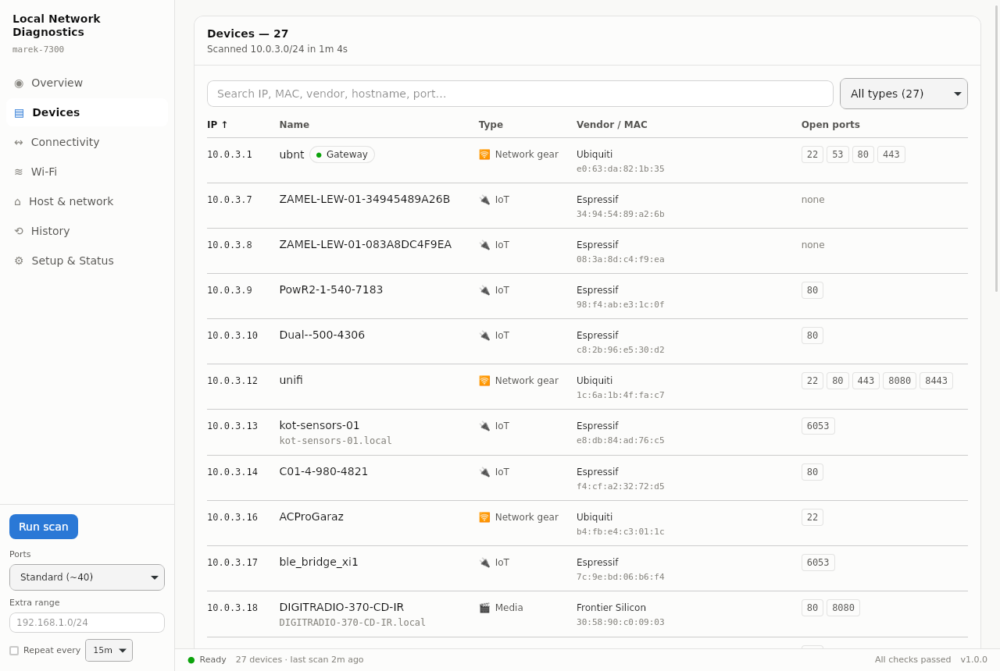
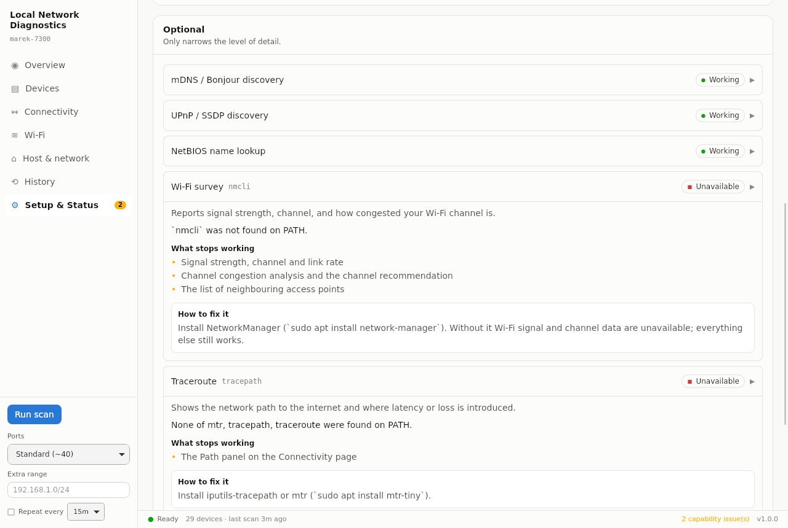

# Local Network Diagnostics

[](https://github.com/MarkoVcode/local-network-diag/actions/workflows/ci.yml)
[](https://github.com/MarkoVcode/local-network-diag/actions/workflows/release.yml)
[](LICENSE)
[](https://github.com/MarkoVcode/local-network-diag/releases)

A cross-platform desktop app that discovers every device on your local network,
identifies it, measures connectivity and Wi-Fi health, and tracks what changes
between scans.

Runs on **Windows, macOS and Linux**. Needs **no administrator privileges** and
**no extra tools installed**.



---

## Install

Download the installer for your platform from the
[Releases](https://github.com/MarkoVcode/local-network-diag/releases) page:

| Platform | File |
| --- | --- |
| Windows | `.msi` or `.exe` (NSIS setup) |
| macOS (Apple silicon) | `_aarch64.dmg` |
| macOS (Intel) | `_x64.dmg` |
| Linux | `.AppImage` (portable), `.deb`, or `.rpm` |

Releases are **not code-signed**, so on first launch:

- **macOS** — Gatekeeper blocks it. Right-click the app → *Open*, or run
  `xattr -dr com.apple.quarantine "/Applications/Local Network Diagnostics.app"`.
- **Windows** — SmartScreen shows "Windows protected your PC". Click
  *More info* → *Run anyway*.

---

## What it extracts

**Per device**
- IPv4 address, MAC, and vendor from the bundled IEEE OUI registry (53k prefixes)
- Randomized/private MACs detected and flagged rather than mislabelled
- Hostnames from mDNS, NetBIOS, reverse DNS and UPnP
- Open TCP ports with service names
- HTTP status / `Server` / page title / full response headers
- TLS certificate subject, issuer, SANs, expiry, self-signed detection
- Complete mDNS TXT records — ESPHome chip and firmware, Home Assistant version,
  printer capabilities, Apple device identifiers
- UPnP device description: manufacturer, model, serial number
- Device-type inference, **with the evidence that produced it**

**Network**
- Interfaces, addresses, MTU, link state, routing table
- DNS configuration and per-resolver response timing
- Gateway and WAN latency with min/avg/max/jitter/loss
- Public IP, traceroute with per-hop loss
- Wi-Fi link stats, channel-congestion survey and a channel recommendation

---

## Setup & Status

The app includes a **Setup & Status** page that reports what it can actually do
on your machine, tiered by how much it matters:

| Tier | Meaning |
| --- | --- |
| **Required** | The app cannot scan without this. Scanning is disabled and a blocking banner explains why. |
| **Important** | Scanning still works, but a major feature is lost. |
| **Optional** | Only narrows the level of detail. |

Anything not working states **what stops working** and **how to fix it**, with
the exact command for your OS. A badge on the sidebar and a status-bar link
surface problems without opening the page.

These are **functional probes, not `which` checks** — which matters, because a
binary being present says very little:

- On Linux, `ping` can exist but be unable to open an ICMP socket without
  `cap_net_raw`.
- On macOS 14+, the Wi-Fi tools exist but return nothing until Location Services
  permission is granted.
- Inside a container, the ARP table can be readable but permanently empty.

Each check therefore *performs* the operation and reports what really happened.



---

## How it works without privileges

Raw-socket ARP scanning and SYN scanning both need root/Administrator. This app
uses neither:

| Need | Approach |
| --- | --- |
| Host liveness | The system `ping` binary, which is capability-endowed on every supported OS |
| **MAC addresses** | Pinging populates the kernel's ARP/neighbour cache as a side effect; the OS's own tool then reads it back unprivileged |
| Open ports | Full TCP connect scan on ordinary sockets |
| Service identity | mDNS, SSDP and NetBIOS implemented directly on UDP sockets |

A host that ignores ICMP is still found: the TCP phase scans every address in
range, a refused connection proves the host is up, and the neighbour cache is
re-read afterwards to recover MACs the first pass missed.

> **On Windows**, that last signal is weaker. Windows Firewall commonly *drops*
> connections to closed ports rather than rejecting them, which makes a closed
> port indistinguishable from a filtered one. A device that ignores ping *and*
> has none of the scanned ports open may therefore go undetected on Windows,
> where it would be found on Linux or macOS. The Setup & Status page states this
> explicitly when running on Windows.

### Portable by default

mDNS, SSDP, NetBIOS, DNS and the port scanner are implemented in Rust directly on
sockets, so they behave identically everywhere and need **no Avahi, Bonjour,
nmap, or Samba tools installed**. Only four things genuinely differ per OS and
live behind a small platform layer:

| | Linux | macOS | Windows |
| --- | --- | --- | --- |
| ARP table | `ip neigh` | `arp -an` | `arp -a` |
| Routes | `ip route` | `route` / `netstat` | `route print` |
| Resolvers | `resolvectl` | `scutil --dns` | `Get-DnsClientServerAddress` |
| Wi-Fi | `nmcli` | `system_profiler` | `netsh wlan` |

Platform differences that bite are covered by tests — for example BSD `ping`
takes `-W` in **milliseconds** where Linux takes **seconds**, and Windows `ping`
exits 0 even when every reply is "Destination host unreachable".

### Off-subnet discovery

mDNS and SSDP run **before** the sweep, because they reveal addresses outside the
local subnet. Any private range they announce is added to the scan
automatically — on the development network this surfaced a Home Assistant
instance on a subnet the host had no route-table knowledge of.

Docker bridges and link-down interfaces are excluded, and any range wider than a
`/22` is refused so a typo cannot queue a 65k-host sweep.

---

## Repeatability

- **Run scan** — live per-phase progress, cancellable.
- **Repeat every 5/15/60 min** — a background supervisor runs scans unattended.
- **History** — every run stored as JSON in the OS app-data directory (last 200).
- **Changes** — appeared / disappeared / IP changed / ports opened / ports closed.
- **Export** — JSON (everything) or CSV (device list) via a native save dialog.

Devices are paired across runs by MAC first, then by IP. Both passes matter:
matching on MAC makes a DHCP lease change read as "same device, new address", and
the IP fallback stops a device whose MAC resolved in only one of the two runs
from being reported as both "gone" and "new". Port deltas are suppressed when the
two runs used different port profiles, since unprobed is not the same as closed.
The first scan is marked as a baseline, so nothing is flagged "new" when there is
nothing to be new against.

---

## Architecture

```
crates/netdiag-core/     Engine. No GUI dependency at all.
  src/scan/              mdns, ssdp, netbios, ports, sweep, banners,
                         connectivity, correlate, dns, http, hostinfo, wifi
  src/platform/          linux.rs · macos.rs · windows.rs
  src/doctor.rs          Capability probes
  src/store.rs           Snapshot persistence, pairing and diffing
  src/bin/netdiag-cli.rs Headless entry point
src-tauri/               Desktop shell: window, commands, events, scheduler
app/ components/ lib/    Next.js static export (no server, no API routes)
```

The engine is a **standalone crate with no Tauri dependency**, so it builds and
its 92 tests run on a machine with no desktop toolchain. That is what lets CI
validate the per-OS code paths on all three platforms cheaply, independently of
whether the GUI builds.

Scan phase order is load-bearing: `announce` precedes `sweep` so off-subnet
ranges are known before targets are fixed, and `connectivity` follows `sweep` so
latency is measured on an idle link rather than one saturated by our own probes.

---

## Development

Prerequisites: **Node ≥ 20**, **Rust ≥ 1.77**, and the Tauri system
dependencies for your OS
([Tauri prerequisites](https://tauri.app/start/prerequisites/)).

On Ubuntu/Debian:

```bash
sudo apt install libwebkit2gtk-4.1-dev libsoup-3.0-dev librsvg2-dev \
                 libxdo-dev libssl-dev libayatana-appindicator3-dev patchelf
```

```bash
npm install
npm run dev        # run the desktop app with hot reload
npm run build      # produce installers for the current platform

npm run test:core  # engine tests (no GUI toolchain needed)
npm run doctor     # capability report from the terminal
npm run typecheck
npm run lint
```

The headless CLI is useful for debugging the engine without the GUI:

```bash
cargo run -p netdiag-core --bin netdiag-cli -- doctor
cargo run -p netdiag-core --bin netdiag-cli -- scan standard
```

### Refreshing the vendor database

`crates/netdiag-core/data/oui.json` is committed so the app identifies hardware
with no internet access — which matters, since a network diagnostic tool is often
run precisely when the internet is broken. Regenerate it with the IEEE registries
when it ages.

---

## Releasing

CI (`.github/workflows/ci.yml`) runs on every push: engine tests, clippy and the
capability doctor on **Linux, macOS and Windows**, plus frontend typecheck/lint
and a desktop build on all three.

To publish, push a tag:

```bash
git tag v1.0.0 && git push origin v1.0.0
```

`.github/workflows/release.yml` builds Windows, macOS (Apple silicon **and**
Intel) and Linux, uploads every installer to a draft GitHub release, and
publishes it once all platforms succeed. Linux is built on `ubuntu-22.04`
deliberately: glibc is forward- but not backward-compatible, so building on a
newer image would break older distributions.

### Code signing

Builds are unsigned by default and work fine. To sign, add these repository
secrets — the workflow already references them and skips signing when unset:

| Platform | Secrets |
| --- | --- |
| macOS | `APPLE_CERTIFICATE`, `APPLE_CERTIFICATE_PASSWORD`, `APPLE_SIGNING_IDENTITY`, `APPLE_ID`, `APPLE_PASSWORD`, `APPLE_TEAM_ID` |
| Windows | `TAURI_WINDOWS_CERTIFICATE_THUMBPRINT` |

---

## Safety

- Every external command runs through a wrapper using **argv arrays with no
  shell**, so an IP or CIDR from the UI can never be interpreted as shell syntax.
  All calls are time-boxed.
- Only **private** address ranges are scanned; the deep-scan action refuses
  public addresses.
- The webview has a strict CSP and **no network permissions** — all I/O happens
  in Rust.
- Missing tools never fail a scan: the probe is marked unavailable, a warning is
  recorded, and everything else still runs.

This tool scans your own network. Do not point it at networks you are not
responsible for.

---

## Not included

No router authentication, so there is no DHCP lease table, no per-client
bandwidth, and no client list from the router itself. The correlation layer takes
identity from independent sources, so router lease data can be merged in later as
one more source.

Path-MTU discovery is also absent: `tracepath` provides it on Linux, but macOS
and Windows have no comparable tool, and a Linux-only field would be misleading.

---

## Contributing

Contributions are welcome — see [CONTRIBUTING.md](CONTRIBUTING.md). The engine
crate builds and tests without any GUI toolchain, so you can work on discovery
logic with just Rust installed.

Please also read the [Code of Conduct](CODE_OF_CONDUCT.md).

## Security

Report vulnerabilities privately — see [SECURITY.md](SECURITY.md). Note that
scan snapshots contain MAC addresses, hostnames and open ports for your network;
review them before sharing in a bug report.

## Legal

This tool performs unauthenticated scanning of the network it is attached to.
Use it only on networks you own or are authorised to test. Scanning networks
without permission may be unlawful in your jurisdiction.

## Credits

Hardware vendor names come from the [IEEE MA-L/MA-M/MA-S registries][ieee].
Built with [Tauri](https://tauri.app), [Next.js](https://nextjs.org) and Rust.

[ieee]: https://standards-oui.ieee.org/

## License

[MIT](LICENSE) © 2026 MarkoVcode and contributors
